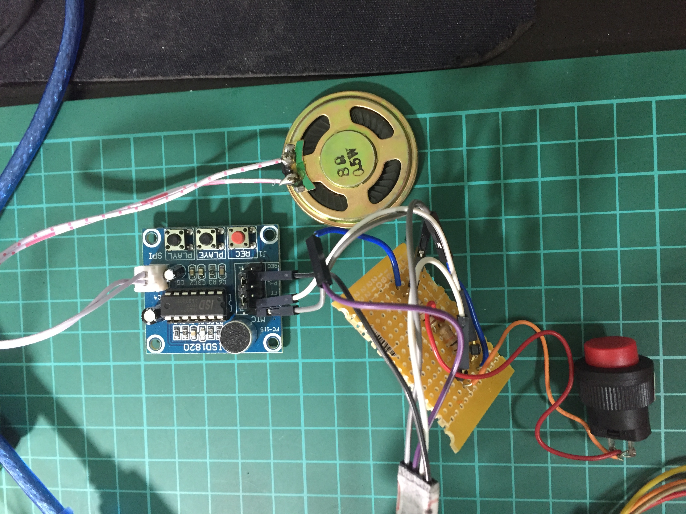
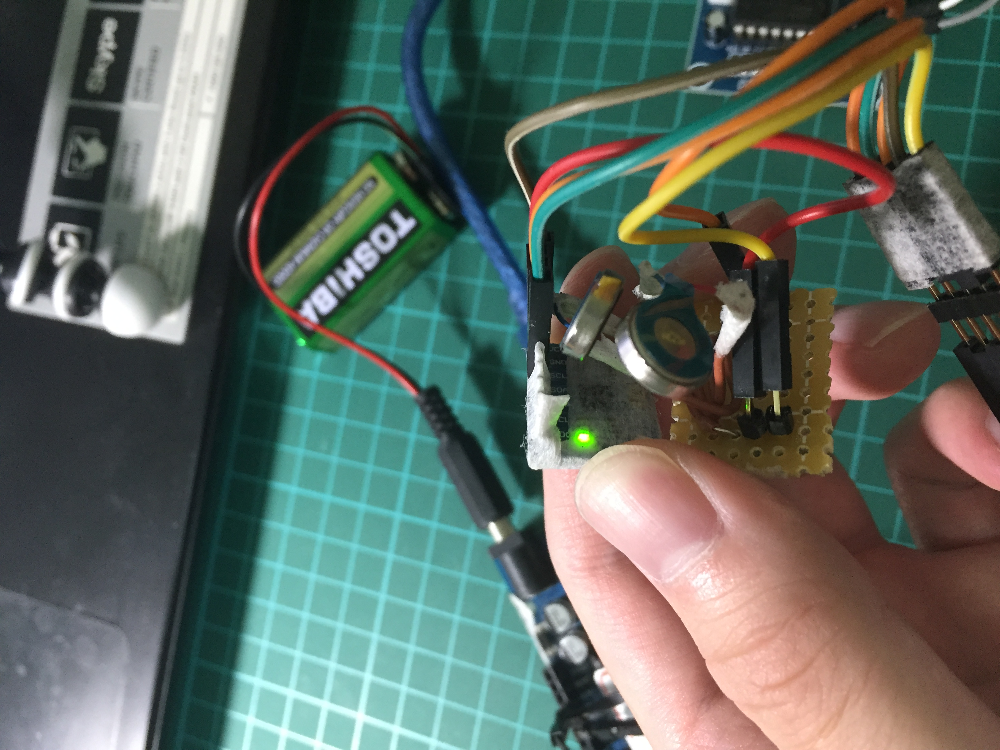
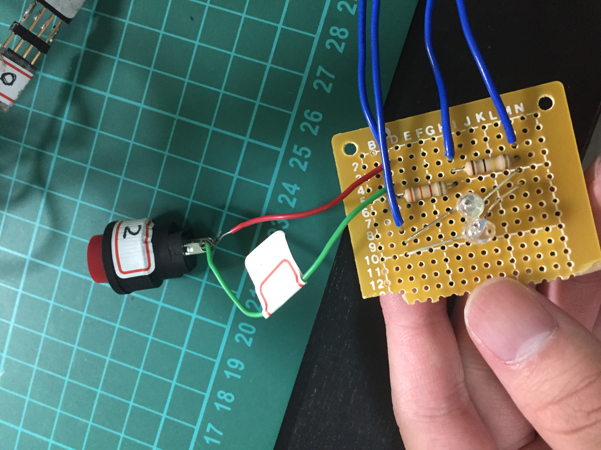
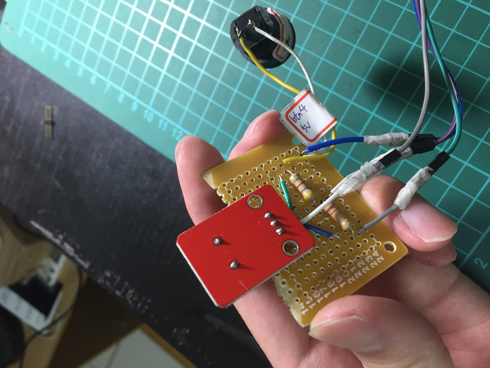

# Single Chip System Design & Application Project, Arduino, Course project
Demo video link 
Showing functions of all application modules: 
https://www.youtube.com/watch?v=_k7vjMCnXuY	 
Showing that different modules can work simultaneously, and can still work if plugs of different modules switched: 
https://www.youtube.com/watch?v=cVUKTLRUsQA  
MPU6050 to detect movements, and the vibration module will vibrate when movements detected: 
https://www.youtube.com/watch?v=PuqwFM8iqFQUsing   

Discarded project idea:	Car toy controlled by smartphone 
Car toy controlled by Android smartphone, using App Inventor and arduino to develop: 
https://www.youtube.com/watch?v=YTaQtLDiKss 
Buzzer and LED lights will turn on when the car toy is flipped: 
https://www.youtube.com/watch?v=iP7ZP7swoYQ 

 
pet toy prototype:

 
Modules: 
Audio playing module: 
<
Vibration module: 

LED module: 

Buzzer module: 

